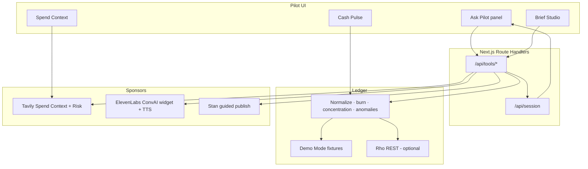

# Pilot

**Talk to Pilot like a CFO** — live liquidity intelligence you can brief in minutes.

Wordmark: **Pilot** with a tiny **rho** mark. Built as a money-brief layer on **Rho**. Decision support with citations — **not** financial, tax, legal, or investment advice. **Read-only** — cannot move money.

---

## Demo flow (&lt;3 minutes)

Use **Demo Mode** (empty keys) or live partner keys. Path: landing → **Ask Pilot**.

| Step | Time | What you do | What judges see |
|---|---|---|---|
| 1. Problem | ~10s | Open `/` | Calm Pilot wordmark + one-liner |
| 2. Commit | ~5s | **Ask Pilot** (or `/talk` → cash + pilot) | Large Pilot panel: Chat / Voice / Sources / Note |
| 3. Peak | ~40s | Chat *“Give me the week…”* or Voice tab | Tool replies with Rho + Tavily; Sources shows traces |
| 4. Spend Context | ~50s | *“Intercom vs public ranges…”* **or** nav **Spend** | Cited comps table + External Risk |
| 5. Ship | ~30s | *“Draft the Weekly Money Brief…”* **or** **Brief Studio** | PDF + standup audio → Confirm → Stan |
| 6. Close | ~15s | Safety line | Read-only · Not financial advice |

**Optional:** *“Walk anomalies since the 1st…”* → Close Pack, or **Note** tab before drafting.

---

## Architecture



**Hero loop:** Ask Pilot → Rho + Tavily tools → draft brief (standup TTS) → Stan. Sources tab shows tool evidence.

**Nav:** Cash · Spend · Exceptions · Brief Studio. Floating **Ask Pilot** on every app page.

---

## Tech stack

| Layer | Choice | Role |
|---|---|---|
| App | **Next.js 16** (App Router) + **TypeScript** | UI + server tool routes |
| Styling | **Tailwind CSS v4** | Rho-inspired mint / white / sidebar cockpit |
| Fonts | **Bodoni Moda** (wordmark) · **Hanken Grotesk** (UI) · **IBM Plex Mono** (IDs) | Brand + product chrome |
| Ledger | Rho-shaped **Demo Mode** fixtures (+ optional live `RHO_API_TOKEN`) | Cash Pulse, anomalies, recurrings |
| Research | **Tavily** Search (`topic: finance`) | Competitive Spend Context + thin External Risk |
| Conversation | **ElevenLabs** ConvAI widget + local chat tool-chain | Decision conversation |
| Audio | ElevenLabs **TTS** when keyed | Brief standup (not a markdown read-aloud) |
| Output | **jsPDF** + markdown brief | Weekly Money Brief / Close Pack |
| Delivery | **Stan** storefront URL (guided publish) | Finish the job |
| Runtime | **Node ≥ 20.9** (`.nvmrc` → 24) | Required by Next 16 |

---

## What it does

1. **Cash Pulse** — multi-account cash, burn/runway, concentration, claim→ID evidence  
2. **Exceptions** — pending / awaiting_approval / first-time / spikes (radar, not verdict)  
3. **Competitive Spend Context** — what you pay vs cited public market ranges (Tavily or demo)  
4. **Ask Pilot** — Chat tool-chain + Voice (ConvAI widget) + Sources + Note  
5. **Brief Studio → Stan** — PDF + standup TTS; confirm before guided publish  

---

## Quick start

```bash
# Next.js 16 needs Node >= 20.9
nvm use          # installs/uses Node 24 from .nvmrc
node -v          # expect v20+ / v24+

npm install
cp .env.example .env.local
npm run dev
```

Open [http://localhost:3000](http://localhost:3000). **Demo Mode works with empty keys.**

### Optional env (`.env.local`)

| Variable | Purpose |
|---|---|
| `RHO_API_TOKEN` | Live Rho REST attempt; leave empty (or `NEXT_PUBLIC_DEMO_MODE=true`) for fixtures |
| `RHO_API_BASE_URL` | Rho API base (default `https://api.rho.co`) |
| `TAVILY_API_KEY` | Live Spend Context Search (+ Extract); without it, demo citations |
| `ELEVENLABS_API_KEY` | Brief TTS + optional Scribe STT + signed-url API |
| `ELEVENLABS_VOICE_ID` | TTS voice (optional) |
| `NEXT_PUBLIC_ELEVENLABS_AGENT_ID` | Voice tab ConvAI widget (public agent ID) |
| `ELEVENLABS_AGENT_ID` | Alias / signed-url fallback |
| `STAN_PRODUCT_URL` | Guided publish destination |
| `TOOL_WEBHOOK_SECRET` | If set, `/api/tools/*` require `x-tool-secret` or `Authorization: Bearer` |

**Tavily live vs demo:** `source` on spend/risk tools is `"tavily"` only when at least one live citation succeeds; otherwise `"demo"`.

**TTS on brief:** `POST /api/tools/generate_brief` sets `audioAvailable` when TTS succeeds; `audioError` explains misses.

**Agent wiring (for judges / hosted demo):**

1. Paste [`src/lib/elevenlabs/prompt.ts`](src/lib/elevenlabs/prompt.ts) into the ElevenLabs Agent system prompt.
2. Agent → **Advanced**: turn **authentication off** (public).
3. Agent → **Tools**: add **Client tools** with these exact names (blocking / wait for result): `get_balances`, `get_anomalies`, `tavily_spend_context`, `tavily_risk_brief`, `generate_brief`, `publish_to_stan` (plus optional `get_transactions`, `get_concentration`).
4. Set `NEXT_PUBLIC_ELEVENLABS_AGENT_ID` (and API key) in the host env; redeploy.
5. Voice tab loads workspace context automatically from demo Rho + Tavily so Pilot can answer even before a tool call.

**Deploy tip:** Same-origin `/api/tools/*` power client tools on Vercel/etc. Do not set `TOOL_WEBHOOK_SECRET` unless Agent server tools send that header.

### Backend smoke checklist

```bash
# Spend Context (expect source tavily + citationCount > 0 when key set)
curl -s http://localhost:3000/api/tools/tavily_spend_context | jq '{source,citationCount,errors}'

# External risk (live headlines when keyed)
curl -s http://localhost:3000/api/tools/tavily_risk_brief | jq '{source,items:[.items[].headline]}'

# Brief + TTS
curl -s -X POST http://localhost:3000/api/tools/generate_brief \
  -H 'content-type: application/json' \
  -d '{"type":"weekly_money_brief"}' | jq '{audioAvailable,audioError,spendSource,riskSource}'

# Optional signed URL (Voice widget / private agents)
curl -s http://localhost:3000/api/elevenlabs/signed-url | jq '{ok,agentId}'
```

---

## Tool APIs (agent webhooks)

| Route | Purpose |
|---|---|
| `GET /api/tools/get_balances` | Cash position + burn/runway |
| `GET /api/tools/get_transactions` | Normalized transactions |
| `GET /api/tools/get_anomalies` | Anomaly radar |
| `GET /api/tools/get_concentration` | Vendor concentration |
| `GET /api/tools/tavily_spend_context` | Competitive Spend Context (`summary` + cites) |
| `GET /api/tools/tavily_risk_brief` | Thin External Risk |
| `POST /api/tools/generate_brief` | Draft weekly brief or close pack (+ TTS) |
| `POST /api/tools/publish_to_stan` | `{ "confirmed": true }` → Stan URL |
| `POST /api/tools/voice_capture` | `{ transcript }` or `{ audioBase64 }` (Scribe) |
| `GET /api/elevenlabs/signed-url` | ConvAI signed URL |
| `GET /api/session` | Tool traces + briefs |

System prompt for a hosted ElevenLabs agent: [`src/lib/elevenlabs/prompt.ts`](src/lib/elevenlabs/prompt.ts).

---

## Sample data

Demo ledger includes Operating / Reserve / Treasury accounts; recurring Intercom, Notion, AWS, Figma; contractor Jordan via Deel; Gusto payroll; Northpeak first-time wire; PQRS Cloud; pending Intercom; awaiting_approval ACH; failed card.

---

## Safety posture

- Read-only on Rho — no payments, wires, or account changes  
- Compare and cite — no hire/cut/renew prescriptions  
- Not tax, legal, employment, or investment advice  
- Market comps are public-web estimates with sources  

Product requirements: [PRD.md](./PRD.md).
