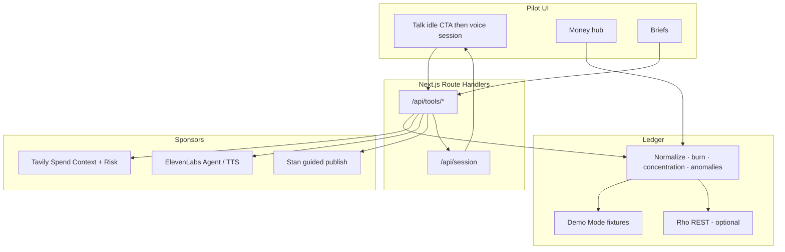

# Pilot

**Talk to Pilot like a CFO** — live liquidity intelligence you can brief in minutes.

Wordmark: **Pilot** with a tiny **rho** mark. Built as a money-brief layer on **Rho**. Decision support with citations — **not** financial, tax, legal, or investment advice. **Read-only** — cannot move money.

---

## Demo flow (&lt;3 minutes)

Use **Demo Mode** (empty keys) or live partner keys. Path: landing → **Talk**.

| Step | Time | What you do | What judges see |
|---|---|---|---|
| 1. Problem | ~10s | Open `/` | Calm Pilot wordmark + one-liner |
| 2. Commit | ~5s | **Talk** → click **Talk to Pilot** | Idle screen is one CTA (Hick’s Law). Click starts the session |
| 3. Peak | ~40s | Speak/type *“Give me the week…”* | **Halftone appears only after the click**; pulses while tools run; cash truth in reply |
| 4. Spend Context | ~50s | *“Intercom and Jordan vs public ranges…”* **or** **Money → Spend Context** | Cited comps table; open **Evidence** only if you want tool traces |
| 5. Ship | ~30s | *“Draft the Weekly Money Brief…”* **or** **Briefs** | PDF → Confirm → Stan |
| 6. Close | ~15s | End session / safety line | Read-only · Not financial advice |

**Optional:** *“Walk anomalies since the 1st…”* → Close Pack, or **Add note** inside the session before drafting.

Idle Talk has no always-on halftone, traces, or prompt chips — progressive disclosure only.

---

## Architecture



**Hero loop:** Click **Talk to Pilot** → living halftone voice field → Rho-shaped ledger truth → Tavily citations → draft brief → Stan. Evidence stays behind a drawer until asked.

---

## Tech stack

| Layer | Choice | Role |
|---|---|---|
| App | **Next.js 16** (App Router) + **TypeScript** | UI + server tool routes |
| Styling | **Tailwind CSS v4** | Rho-inspired mint / white / sidebar cockpit |
| Fonts | **Bodoni Moda** (wordmark) · **Hanken Grotesk** (UI) · **IBM Plex Mono** (IDs) | Brand + product chrome |
| Ledger | Rho-shaped **Demo Mode** fixtures (+ optional live `RHO_API_TOKEN`) | Cash Pulse, anomalies, recurrings |
| Research | **Tavily** Search (`topic: finance`) | Competitive Spend Context + thin External Risk |
| Conversation | **ElevenLabs** Agents (iframe when configured) + chat tool-chain | Decision conversation |
| Audio | ElevenLabs **TTS** when keyed | Brief Production Studio standup |
| Output | **jsPDF** + markdown brief | Weekly Money Brief / Close Pack |
| Delivery | **Stan** storefront URL (guided publish) | Finish the job |
| Runtime | **Node ≥ 20.9** (`.nvmrc` → 24) | Required by Next 16 |

---

## What it does

1. **Cash Pulse** — multi-account cash, burn/runway, merchant normalization, concentration, claim→ID evidence  
2. **Anomaly Radar** — pending / awaiting_approval / first-time / spikes (radar, not verdict)  
3. **Competitive Spend Context** — what you pay vs cited public market ranges (Tavily or demo citations)  
4. **Talk** — idle = one **Talk to Pilot** CTA; click reveals animated **halftone** + session (chat fallback / ElevenLabs)  
5. **Money** — hub for Cash Pulse, Anomalies, Spend Context  
6. **Briefs → Stan** — PDF + TTS when keyed; confirm before guided publish  
7. **Add note** — progressive Voice Capture inside an open session only

---

## Quick start

```bash
# Next.js 16 needs Node >= 20.9
nvm use          # installs/uses Node 24 from .nvmrc
node -v          # expect v20+ / v24+

npm install
cp .env.example .env.local
npm run dev
```

Open [http://localhost:3000](http://localhost:3000). **Demo Mode works with empty keys.**

### Optional env (`.env.local`)

| Variable | Purpose |
|---|---|
| `RHO_API_TOKEN` | Live Rho; leave empty for Demo Mode |
| `TAVILY_API_KEY` | Live Spend Context citations |
| `ELEVENLABS_API_KEY` / `ELEVENLABS_VOICE_ID` | Brief TTS |
| `NEXT_PUBLIC_ELEVENLABS_AGENT_ID` | Embedded voice agent |
| `STAN_PRODUCT_URL` | Guided publish destination |

---

## Tool APIs (agent webhooks)

| Route | Purpose |
|---|---|
| `GET /api/tools/get_balances` | Cash position + burn/runway |
| `GET /api/tools/get_transactions` | Normalized transactions |
| `GET /api/tools/get_anomalies` | Anomaly radar |
| `GET /api/tools/get_concentration` | Vendor concentration |
| `GET /api/tools/tavily_spend_context` | Competitive Spend Context |
| `GET /api/tools/tavily_risk_brief` | Thin External Risk |
| `POST /api/tools/generate_brief` | Draft weekly brief or close pack |
| `POST /api/tools/publish_to_stan` | `{ "confirmed": true }` → Stan URL |
| `POST /api/tools/voice_capture` | Store transcript for brief |
| `GET /api/session` | Tool traces + briefs |

System prompt for a hosted ElevenLabs agent: [`src/lib/elevenlabs/prompt.ts`](src/lib/elevenlabs/prompt.ts).

---

## Sample data

Demo ledger includes Operating / Reserve / Treasury accounts; recurring Intercom, Notion, AWS, Figma; contractor Jordan via Deel; Gusto payroll; Northpeak first-time wire; PQRS Cloud; pending Intercom; awaiting_approval ACH; failed card.

---

## Safety posture

- Read-only on Rho — no payments, wires, or account changes  
- Compare and cite — no hire/cut/renew prescriptions  
- Not tax, legal, employment, or investment advice  
- Market comps are public-web estimates with sources  

Product requirements: [PRD.md](./PRD.md).
